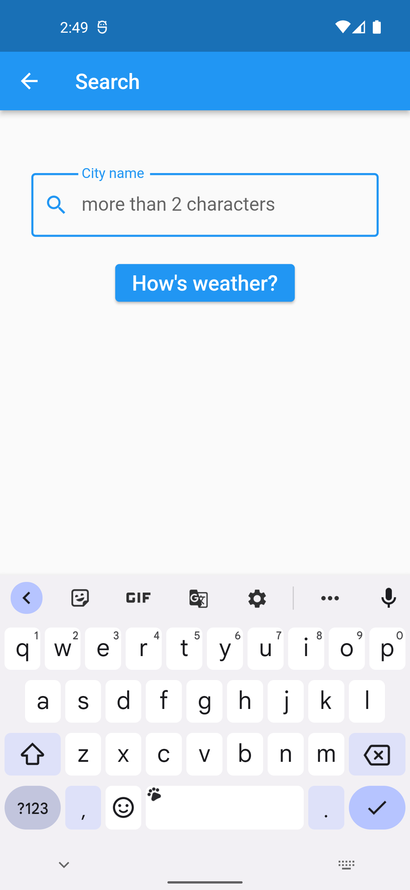
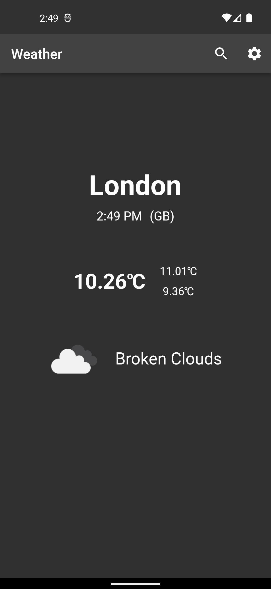

# Open Weather Bloc Listener

A Flutter project with Bloc and a Weather API from "Open Weather Map". 

## Features using Bloc

There are many features in this project using Bloc such as:

- Change temperature between ℃ and ℉;
- Theme app changes the temperature accordingly, if it is bigger than a constant (kWarnOrNot) the theme app will be light. On the other hand, it’ll be dark;
- Bloc deals with the API response, with Weather status like initial, loading, loaded and error.

## Screenshots

|                                                                                       |                                                                                                                    |                                                                                                    |
|:-------------------------------------------------------------------------------------:|:------------------------------------------------------------------------------------------------------------------:|:--------------------------------------------------------------------------------------------------:|
|             Initial State            |                        Temp Settings                        |                     Select a city                    |
|             Dark Theme             |                        Light Theme                      